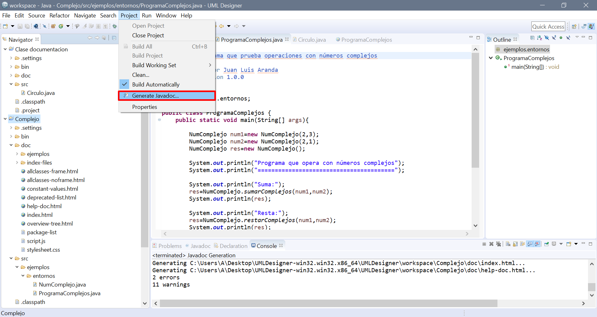

# EJERCICIO FINAL DE ENTORNOS DE DESARROLLO

## Práctica final con JavaDoc - 1º DAM

Consiste en ir comentando con Javadoc todas las clases del ejercicicio.

Para ello se explica en este documento realizado con la documentación Markdown.

(Este [enlace](https://www.markdownguide.org/basic-syntax/) te llevará a la **web de documentación Markdown**.)

### Cómo generar la documentación de Javadoc

Este paso es muy simple y se realiza de forma automática con tan solo hacer unos pocos de clicks.

En este caso, al utilizar Eclipse, (en NetBeans también existe la posibilidad de realizarla) encontraremos en la parte superior la pestaña *Project* y después hacer click en *Generate Javadoc...* como se muestra en la imágen.

Así se creará una carpeta llamada *doc* donde trendremos uno de los muchos archivos creados que se llama *index.html* en el cual nos aparecerá toda la documentación realizada con **Javadoc**.
